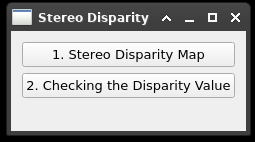
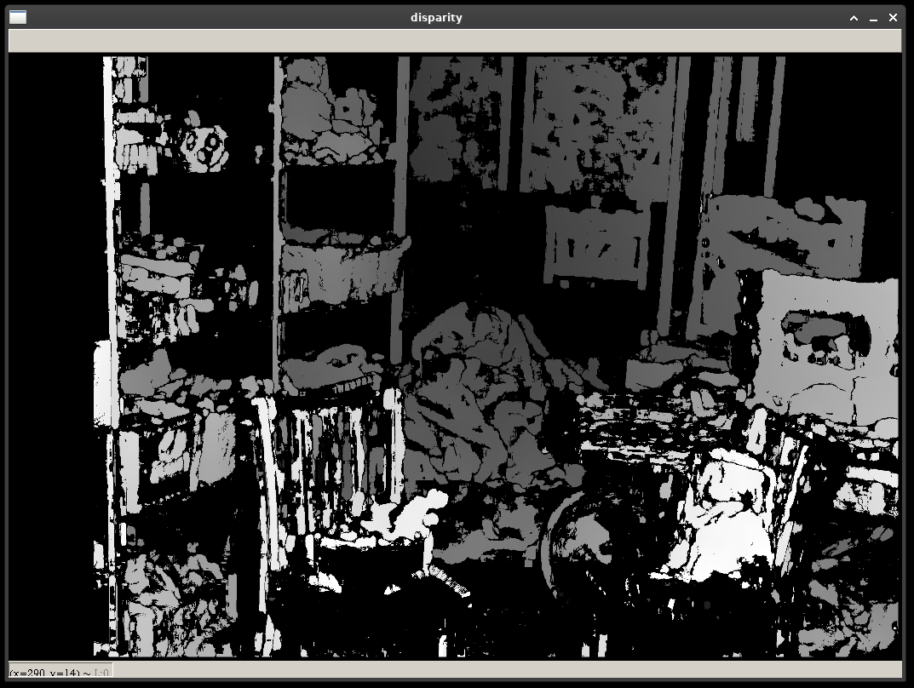

# stereo-disparity-map-opencv

A simple example of stereo disparity map of OpenCV.

To run: `python main.py`

## Screenshots

- Show Stereo Disparity Map:  
  

- Click on the left image and show the corresponding point on the right image:  
  